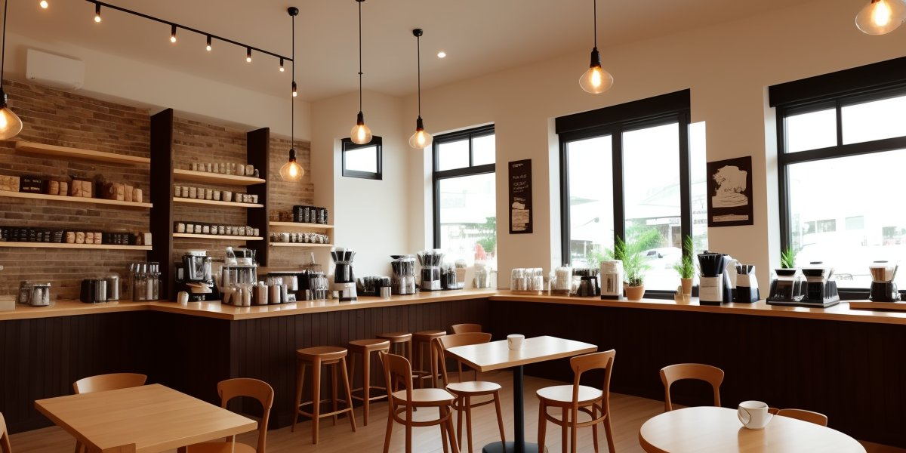
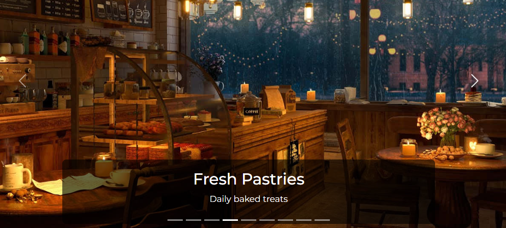
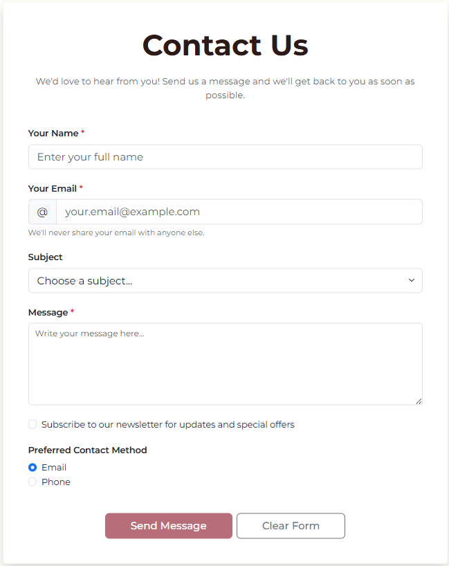

# Web Development Assignment #4 Report

## Media Queries + Bootstrap Grid

---

## Team Information

- **Team Name:** Coffee PO Team
- **Group:** SE-2404
- **Team Members:** Balgyn, Ayana
- **Submission Date:** October 4, 2025
- **Deployed Website URL:** [Your GitHub Pages/Netlify URL here]

---

## Part 1: Media Queries

### Task 1: Responsive Typography

**Implementation:**
Created responsive font sizes that change based on screen size.

**Code:**

```css
/* Mobile (< 576px) */
.responsive-title {
  font-size: 1.75rem;
}

/* Tablet (≥ 768px) */
@media (min-width: 768px) {
  .responsive-title {
    font-size: 2.5rem;
  }
}

/* Desktop (≥ 992px) */
@media (min-width: 992px) {
  .responsive-title {
    font-size: 3rem;
  }
}
```

---

### Task 2: Card Group - Responsive Layout

**Implementation:**
Three cards display side-by-side on desktop, 2 per row on tablet, stacked on mobile using CSS media queries only.

**Code:**

```css
/* Mobile: Stack vertically */
@media (max-width: 767px) {
  .card-responsive-group > div {
    flex: 0 0 100%;
    max-width: 100%;
  }
}

/* Tablet: Two per row */
@media (min-width: 768px) and (max-width: 991px) {
  .card-responsive-group > div {
    flex: 0 0 50%;
    max-width: 50%;
  }
}

/* Desktop: Three per row */
@media (min-width: 992px) {
  .card-responsive-group > div {
    flex: 0 0 33.333%;
    max-width: 33.333%;
  }
}
```

---

## Part 2: Bootstrap Integration

### Task 3: Bootstrap Grid Layout

**Implementation:**
Used Bootstrap's grid system with 2-column and 3-column layouts.

**Code:**

```html
<!-- Two Column Section -->
<div class="row g-4 mb-5">
  <div class="col-lg-6 col-md-6 col-sm-12">
    <div class="p-4 bg-white rounded shadow-sm h-100">
      <h3 class="mb-3">Our Story</h3>
      <p>Content...</p>
    </div>
  </div>
  <div class="col-lg-6 col-md-6 col-sm-12">
    <div class="p-4 bg-white rounded shadow-sm h-100">
      <h3 class="mb-3">Our Mission</h3>
      <p>Content...</p>
    </div>
  </div>
</div>
```

---

### Task 4: Bootstrap Spacing Utilities

**Implementation:**
Replaced custom margins/paddings with Bootstrap spacing classes.

**Bootstrap Classes Used:**

- `py-5` - Vertical padding
- `my-5` - Vertical margin
- `mb-4` - Bottom margin
- `g-4` - Grid gap
- `p-4` - Padding all sides
- `px-lg-4` - Responsive horizontal padding

**Example:**

```html
<section class="container-fluid py-5 bg-light">
  <div class="container my-5">
    <div class="row g-4 mb-5"></div>
  </div>
</section>
```

**Screenshots:**


---

### Task 5: Bootstrap Navigation Bar

**Implementation:**
Responsive navbar with hamburger menu for mobile devices.

**Code:**

```html
<nav class="navbar navbar-expand-lg navbar-dark bg-dark sticky-top">
  <div class="container-fluid px-lg-4 px-3">
    <a class="navbar-brand fw-bold text-warning" href="index.html">Coffee PO</a>
    <button
      class="navbar-toggler"
      type="button"
      data-bs-toggle="collapse"
      data-bs-target="#navbarNav"
    >
      <span class="navbar-toggler-icon"></span>
    </button>
    <div class="collapse navbar-collapse" id="navbarNav">
      <ul class="navbar-nav ms-auto">
        <li class="nav-item">
          <a class="nav-link active" href="index.html">Home</a>
        </li>
        <!-- More links... -->
      </ul>
    </div>
  </div>
</nav>
```

**Screenshots:**


---

### Task 6: Bootstrap Buttons

**Implementation:**
Replaced custom buttons with Bootstrap button classes and created button groups.

**Code:**

```html
<!-- Primary Button -->
<a href="#" class="btn btn-primary mt-3">Learn More</a>

<!-- Outline Button -->
<a href="menu.html" class="btn btn-outline-primary mt-3">View Menu</a>

<!-- Button Group -->
<div class="btn-group btn-group-lg" role="group">
  <a href="menu.html" class="btn btn-outline-dark">Our Menu</a>
  <a href="gallery.html" class="btn btn-outline-dark">Gallery</a>
  <a href="contact.html" class="btn btn-outline-dark">Contact Us</a>
</div>
```

**Screenshots:**


---

### Task 7: Bootstrap Carousel

**Implementation:**
Added carousel with 9 images, navigation controls, and indicators on homepage.

**Code:**

```html
<div id="heroCarousel" class="carousel slide" data-bs-ride="carousel">
  <div class="carousel-indicators">
    <button
      type="button"
      data-bs-target="#heroCarousel"
      data-bs-slide-to="0"
      class="active"
    ></button>
    <!-- 8 more indicators... -->
  </div>
  <div class="carousel-inner">
    <div class="carousel-item active">
      
      <div class="carousel-caption d-none d-md-block">
        <h1 class="display-3 fw-bold">coffee PO</h1>
      </div>
    </div>
    <!-- 8 more items... -->
  </div>
  <button
    class="carousel-control-prev"
    type="button"
    data-bs-target="#heroCarousel"
    data-bs-slide="prev"
  >
    <span class="carousel-control-prev-icon"></span>
  </button>
  <button
    class="carousel-control-next"
    type="button"
    data-bs-target="#heroCarousel"
    data-bs-slide="next"
  >
    <span class="carousel-control-next-icon"></span>
  </button>
</div>
```

**CSS for Responsive Height:**

```css
.carousel-img {
  height: 600px;
  object-fit: cover;
}

@media (max-width: 768px) {
  .carousel-img {
    height: 400px;
  }
}

@media (max-width: 576px) {
  .carousel-img {
    height: 300px;
  }
}
```

**Screenshots:**




---

### Task 8: Bootstrap Cards

**Implementation:**
Replaced custom content boxes with Bootstrap cards on all pages.

**Code:**

```html
<div class="col-lg-4 col-md-6 col-sm-12">
  <div class="card h-100 shadow-sm border-0">
    
    <div class="card-body d-flex flex-column">
      <h3 class="card-title fw-bold">Cozy Atmosphere</h3>
      <p class="card-text flex-grow-1">Experience the warmth...</p>
      <a href="#" class="btn btn-primary mt-3">Learn More</a>
    </div>
  </div>
</div>
```

**Pages with Cards:**

- index.html: 3 feature cards
- gallery.html: 9 photo cards
- menu.html: 5 menu cards

---

### Task 9: Responsive Form Design

**Implementation:**
Replaced custom form styling with Bootstrap form classes on contact page.

**Code:**

```html
<form>
  <!-- Text Input -->
  <div class="mb-4">
    <label for="name" class="form-label fw-semibold">Your Name</label>
    <input
      type="text"
      class="form-control form-control-lg"
      id="name"
      placeholder="Enter your full name"
      required
    />
  </div>

  <!-- Email with Input Group -->
  <div class="mb-4">
    <label for="email" class="form-label fw-semibold">Your Email</label>
    <div class="input-group input-group-lg">
      <span class="input-group-text">@</span>
      <input type="email" class="form-control" id="email" required />
    </div>
    <div class="form-text">We'll never share your email.</div>
  </div>

  <!-- Select Dropdown -->
  <div class="mb-4">
    <label for="subject" class="form-label fw-semibold">Subject</label>
    <select class="form-select form-select-lg" id="subject">
      <option>Choose a subject...</option>
      <option>General Inquiry</option>
      <option>Reservation</option>
    </select>
  </div>

  <!-- Checkbox -->
  <div class="form-check">
    <input class="form-check-input" type="checkbox" id="newsletter" />
    <label class="form-check-label" for="newsletter">
      Subscribe to our newsletter
    </label>
  </div>

  <!-- Radio Buttons -->
  <div class="form-check">
    <input
      class="form-check-input"
      type="radio"
      name="contact"
      id="contactEmail"
      checked
    />
    <label class="form-check-label" for="contactEmail">Email</label>
  </div>

  <!-- Submit Button -->
  <button type="submit" class="btn btn-primary btn-lg">Send Message</button>
</form>
```

**Screenshots:**



---

### Task 10: Accessibility

**Implementation:**
Used semantic HTML and ARIA labels for better accessibility.

**Code Examples:**

```html
<!-- Semantic Navigation -->
<nav class="navbar navbar-expand-lg">
  <ul class="navbar-nav">
    <li class="nav-item">
      <a class="nav-link active" aria-current="page" href="index.html">Home</a>
    </li>
  </ul>
</nav>

<!-- ARIA Labels -->
<button class="navbar-toggler" aria-label="Toggle navigation">
  <span class="navbar-toggler-icon"></span>
</button>

<a href="#" class="btn btn-outline-light" aria-label="Visit our Facebook page">
  Facebook
</a>

<!-- Form Labels -->
<label for="email" class="form-label">Your Email</label>
<input type="email" class="form-control" id="email" />
```

**Screenshots:**


---

## Conclusion

Successfully completed Assignment #4 by integrating Bootstrap framework into the existing Coffee PO website. All 10 tasks were implemented with proper responsive design, accessibility features, and clean code structure.

**Prepared By:** Balgyn & Ayana  
**Date:** October 4, 2025  
**Course:** Web Development, SE-2404

---

_End of Report_
